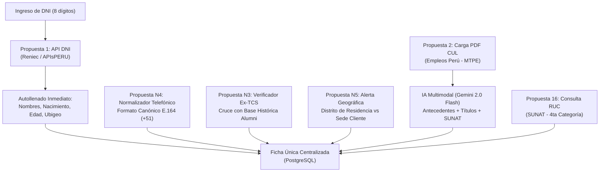
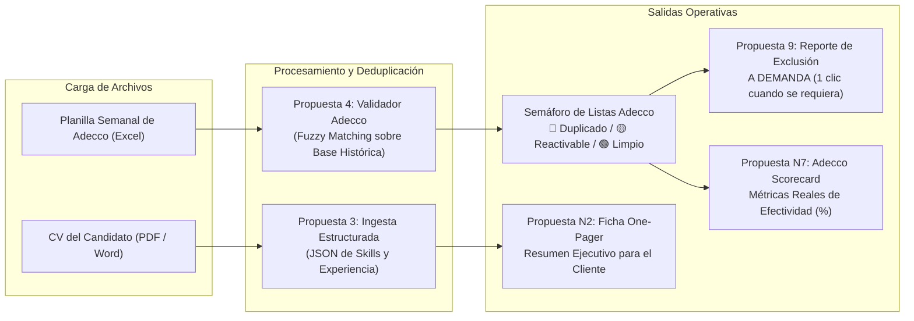
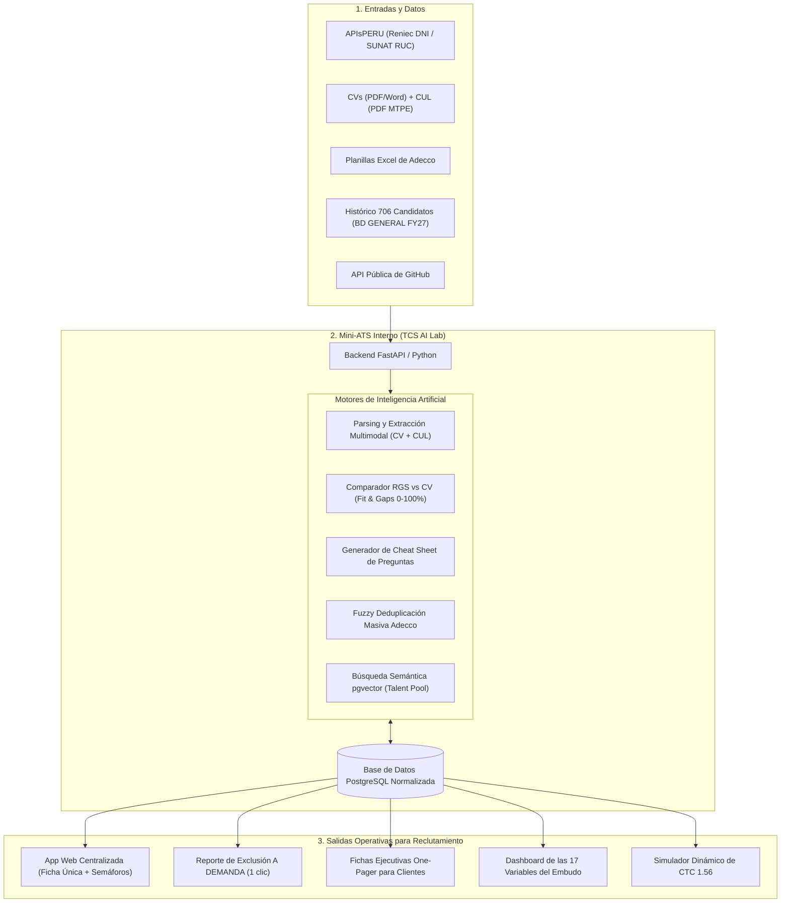
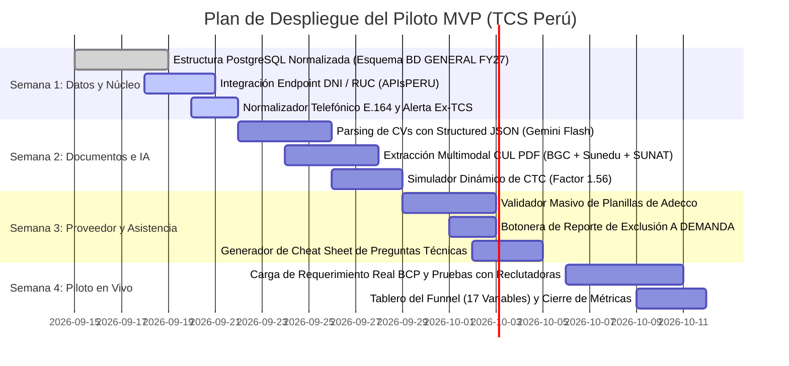

# CATÁLOGO DE PROPUESTAS DE INNOVACIÓN (SELECCIÓN Y EXPANSIÓN)
# RECLUTAMIENTO INTELIGENTE CON APIS, DATOS NACIONALES Y MODELOS DE IA
## Sistema Operativo para Reclutamiento Tecnológico — TCS (Perú / LATAM)

> **Documento Actualizado de Trabajo:** Versión Depurada y Expandida  
> **Fecha:** Septiembre de 2026  
> **Estado:** Filtrado según retroalimentación formal (descartes de propuestas no viables aplicados) y expandido con nuevas iniciativas de alto impacto.  
> **Enfoque Rector:** Automatización del dato propio, enriquecimiento nacional peruano (DNI, CUL, SUNAT), asistencia técnica a la reclutadora humana y control algorítmico del proveedor Adecco sin bots externos de LinkedIn.

---

## 1. CONTROL DE FILTRADO Y MATRIZ DE DECISIÓN

### A. Registro Formal de Propuestas Descartadas (Voto: "NO")
Para mantener la trazabilidad documental y no volver a invertir tiempo en iniciativas descartadas, se formaliza la exclusión de las siguientes propuestas:

| # | Propuesta Descartada | Motivo / Criterio de Exclusión |
|---|---|---|
| **6** | Verificación de Riesgo Crediticio (SBS / Equifax) | No prioritario para el alcance operativo actual; fuera del foco central del MVP. |
| **7** | Chatbot de Intake por WhatsApp | Se descarta la interacción automatizada con el candidato por chat; se prioriza el contacto humano directo. |
| **13** | Transcripción de Llamadas (Speech-to-Text) | No se requiere grabación ni transcripción automática de la llamada telefónica. |
| **14** | Evaluador Automatizado de Inglés Técnico | Se mantiene la evaluación de idiomas bajo el canal de evaluación tradicional. |
| **15** | Generador de Retos "Take-Home" Anti-Plagio | No se busca intervenir en la creación de exámenes de código en esta etapa. |
| **17** | Verificación de Colegiatura CIP | No aplica al perfil estándar de desarrollo de software ni a la demanda privada bancaria. |
| **18** | Triage en Listas Restrictivas (PEPs / OFAC / PLAFT) | Excluido del alcance del sistema de reclutamiento (queda en área de Legal/Compliance). |
| **19** | Agendamiento Sincronizado (Calendly / Teams) | Se descarta el agendamiento autoservicio; la reclutadora mantiene la coordinación directa. |
| **21** | Cartas Oferta y Contratos de Trabajo | Fuera del alcance del MVP de selección (corresponde a Onboarding y Legal). |
| **23** | Detector Predictivo de Declinación de Oferta (Drop-off) | No se requiere analítica predictiva compleja de fuga en este momento. |
| **25** | Middleware de Sincronización con Manatal | Se prioriza la solución propia independiente sin depender de las APIs del ATS corporativo. |

---

### B. Matriz Consolidada: 20 Propuestas Aprobadas y Nuevas Ideas

| # | Propuesta | Estado | Horizonte | Costo / Registro | Rol Clave de la Inteligencia Artificial (API Key) |
|---|---|:---:|:---:|---|---|
| **1** | **Autollenado con API de DNI** | **Aprobada** | **AHORA** | S/ 25 - S/ 50 mes (APIsPERU). | Reconciliación de nombres fonéticos y unificación con perfiles de LinkedIn. |
| **2** | **Parsing Inteligente del CUL (MTPE)** | **Aprobada** | **AHORA** | Gratuito en MTPE. ~$0.002 PDF en IA. | Extracción multimodal de antecedentes (PNP/INPE/PJ), títulos Sunedu y experiencia SUNAT. |
| **3** | **Parsing Estructurado de CVs a Base de Datos** | **Aprobada** | **AHORA** | Tokens de LLM (~$0.001 por CV). | Conversión a JSON estructurado de herramientas, años de experiencia y trayectoria. |
| **4** | **Validador Masivo de Planillas de Adecco** | **Aprobada** | **AHORA** | S/ 0.00 (desarrollo interno). | *Fuzzy Matching* semántico para semáforo de duplicados en 3 segundos. |
| **5** | **Generador de Cheat Sheets para la Llamada** | **Aprobada** | **AHORA** | Consumo marginal de tokens. | Preguntas técnicas clave con respuestas esperadas para la reclutadora no técnica. |
| **8** | **Rediscovery Inteligente (Talent Pool RAG)** | **Aprobada** | **AHORA** | S/ 0.00 (`pgvector` en PostgreSQL). | Búsqueda semántica en lenguaje natural sobre los 706+ candidatos históricos. |
| **9** | **Reporte de Exclusión para Adecco A DEMANDA** | **Aprobada (Ajustada)** | **AHORA** | S/ 0.00. | Exportación con un solo clic en cualquier momento para enviarla al proveedor. |
| **10** | **Auditoría Automática de GitHub / GitLab** | **Aprobada** | **AHORA** | API pública de GitHub (gratuita). | Análisis de originalidad de código, autoría real de commits y complejidad técnica. |
| **11** | **Normalizador de Requerimientos (RGS a JD)** | **Aprobada** | **AHORA** | Consumo mínimo de tokens. | Transforma correos desordenados en JDs estructurados y parámetros para Hiring Assistant. |
| **12** | **Simulador Financiero y Calculadora de CTC** | **Aprobada** | **AHORA** | S/ 0.00 (lógica interna D.L. 728). | Conversión Neto-Bruto-CTC (x 1.56), semáforo presupuestal y erradicación de `#DIV/0!`. |
| **16** | **Consulta y Validación de RUC en SUNAT** | **Aprobada (Adicional)** | **AHORA** | Incluido en planes de APIsPERU. | Verifica condición (Habido/Activo) para contrataciones bajo 4ta categoría (RxH). |
| **22** | **Radar Salarial Tech y Benchmarking Local** | **Aprobada** | **AHORA** | Sin costo externo. | Cálculo de percentiles (P25, P50, P75) en Lima para sustentar negociaciones con clientes. |
| **24** | **Tablero en Tiempo Real del Funnel (17 Variables)** | **Aprobada** | **AHORA** | S/ 0.00. | Dashboard web interactivo con auditoría matemática del embudo para Lorena/Delivery. |
| **N1** | **Comparador Semántico RGS vs. CV (Fit & Gap Analysis)** | **NUEVA** | **AHORA** | Tokens de LLM. | Score visual (0-100%) desglosando fortalezas y brechas técnicas exactas del candidato. |
| **N2** | **Generador de Ficha Ejecutiva "One-Pager" para Clientes** | **NUEVA** | **AHORA** | Mínimo consumo de tokens. | Compila la terna del candidato en un PDF ejecutivo listo para presentar al BCP. |
| **N3** | **Detector y Verificador de Ex-Empleados TCS ("Boomerang")** | **NUEVA** | **AHORA** | S/ 0.00 (query relacional). | Alerta si el DNI pertenece a un ex-colaborador TCS, validando su re-ingreso elegible. |
| **N4** | **Normalizador Canónico de Celulares a E.164 (+51)** | **NUEVA** | **AHORA** | S/ 0.00 (algoritmo regex/lógica). | Estandariza teléfonos (`+519XXXXXXXX`), habilitando 1-clic a WhatsApp Web y deduplicación. |
| **N5** | **Alerta Geográfica de Conmutación (Distrito vs. Sede)** | **NUEVA** | **AHORA** | Mínimo consumo de tokens / mapa Lima. | Alerta fricción de transporte si el candidato vive lejos de la sede presencial del cliente. |
| **N6** | **Reactivador de Candidatos Históricos "Enfriados"** | **NUEVA** | **AHORA** | S/ 0.00 (filtro SQL + embeddings). | Rescata postulantes descartados hace 6 meses solo por pretensión salarial ante un RGS nuevo. |
| **N7** | **Scorecard de Calidad y Rendimiento de Adecco** | **NUEVA** | **AHORA** | S/ 0.00 (métrica calculada). | Tablero con el ratio real de CV útil y tasa de duplicidad para auditar al proveedor. |

---

## 2. DETALLE PROFUNDO POR CLÚSTER OPERATIVO

---

### CLÚSTER 1: IDENTIDAD NACIONAL Y VERIFICACIONES DE ENTRADA (PERÚ)

#### PROPUESTA 1: Autollenado de Identidad vía API de DNI (Reniec / APIs Perú)
* **En qué consiste:** Al registrar un candidato, la reclutadora ingresa únicamente los 8 dígitos del DNI. El backend consume un endpoint REST y autocompleta nombres completos, apellidos, fecha de nacimiento y distrito de residencia.
* **Horizonte:** **AHORA (1 día de desarrollo).**
* **Costos y Registros:** Planes operativos de APIsPERU (`apisperu.com`) de **S/ 25 a S/ 50 al mes** por 2,000 a 5,000 consultas.
* **Potenciado por IA:** Reconciliación fonética inteligente: si en LinkedIn el perfil dice *"Beto Castillo"* y Reniec devuelve *"Alberto Castillo Vega"*, la IA asocia la identidad y previene la creación de fichas duplicadas.
* **Impacto:** Elimina 15 segundos de tipeo por candidato y erradica el bug de edad 127 años registrado en el Excel manual.

#### PROPUESTA 2: Extracción Inteligente del CUL (Certificado Único Laboral)
* **En qué consiste:** El candidato remite el PDF emitido gratuitamente por el portal `empleosperu.gob.pe` del MTPE. La IA multimodal lo procesa en 3 segundos.
* **Horizonte:** **AHORA (vía carga de PDF).**
* **Costos y Registros:** Emisión gratuita (S/ 0.00) para todo ciudadano peruano. Costo de API IA: ~$0.0015 USD por documento con Gemini 2.0 Flash.
* **Potenciado por IA:**
  1. *Antecedentes:* Lee las secciones de PNP (Policial), INPE (Judicial) y Poder Judicial (Penal) y asigna estatus automático (`BGC_APROBADO` o `BGC_OBSERVADO`).
  2. *Cotejo SUNAT:* Compara las empresas y meses declarados en la Planilla Electrónica de SUNAT contra el CV, alertando si el candidato infló su experiencia laboral.
  3. *Grados SUNEDU:* Confirma la existencia de grado de Bachiller o Licenciado registrado.
* **Impacto:** Automatiza el 100% de la verificación de antecedentes sin pagar servicios externos de background check.

#### PROPUESTA 16: Consulta Masiva y Validación de RUC en SUNAT (4ta Categoría / RxH)
* **En qué consiste:** Verificación del RUC para profesionales de tecnología que solicitan emitir Recibos por Honorarios o brindar servicios mediante empresas unipersonales.
* **Horizonte:** **AHORA.**
* **Costos y Registros:** Incluido en la misma suscripción de APIsPERU.
* **Potenciado por IA:** Valida la condición de domicilio (Habido) y el estado (Activo), analizando si la actividad económica registrada (CIIU) es compatible con consultoría y desarrollo de software.
* **Impacto:** Brinda flexibilidad inmediata para contratar talento freelance o contratistas especializados bajo esquemas no subordinados.

#### NUEVA PROPUESTA N3: Detector y Verificador de Ex-Empleados de TCS ("Boomerang")
* **En qué consiste:** En el libro maestro de Excel (`BD GENERAL FY27`), la **Columna AA** correspondía a *"Ex TCS"*. El sistema cruza automáticamente el número de DNI contra la base histórica de desvinculaciones y nómina pasada de TCS Perú.
* **Horizonte:** **AHORA.**
* **Costos y Registros:** S/ 0.00 (consulta relacional interna sobre datos corporativos).
* **Potenciado por IA:** Alerta a la reclutadora: *"⚠️ Este candidato trabajó en TCS entre 2022 y 2024 en la cuenta Entel. Motivo de salida: Renuncia voluntaria. Calificación: Recontratable"*.
* **Impacto:** Acelera contrataciones al reactivar talento que ya conoce la cultura y los procesos internos de TCS.

#### NUEVA PROPUESTA N4: Normalizador Canónico de Celulares al Estándar E.164 (+51)
* **En qué consiste:** Uno de los mayores orígenes de duplicados en el Excel manual era la dispersión en cómo se anotaban los teléfonos: `989322088`, `51989322088`, `+51 989 322 088` o `989-322-088`. El sistema implementa un normalizador automático que convierte cualquier variante al formato canónico internacional: `+519XXXXXXXX`.
* **Horizonte:** **AHORA.**
* **Costos y Registros:** S/ 0.00 (algoritmo de regex en backend).
* **Funcionalidad Agregada:** Habilita un botón de **1 clic para abrir WhatsApp Web directo** al número del candidato con un mensaje pre-configurado de la reclutadora.
* **Impacto:** Garantiza la unicidad estricta del registro y ahorra tiempo en marcar números a mano.

#### NUEVA PROPUESTA N5: Alerta Geográfica de Conmutación (Distrito vs. Sede del Cliente)
* **En qué consiste:** En la industria tech en Lima, la distancia geográfica es una de las principales causas de deserción en esquemas híbridos. El sistema toma el distrito de residencia (obtenido del DNI o CV) y lo compara con la sede física del cliente (ej. BCP La Molina, San Isidro o Centro de Lima).
* **Horizonte:** **AHORA.**
* **Costos y Registros:** Mínimo consumo de lógica de cálculo territorial en Lima.
* **Potenciado por IA:** Genera una alerta preventiva en la ficha: *"Candidato reside en Carabayllo/Ventanilla y el puesto exige 3 días presenciales en La Molina (trayecto estimado: > 2 horas por tramo). Fricción de traslado alta: Se sugiere validar su compromiso de presencialidad en la llamada de validación"*.
* **Impacto:** Evita avanzar con candidatos que renunciarán a las pocas semanas por cansancio de transporte.

---

### CLÚSTER 2: INGESTA, PROCESAMIENTO DOCUMENTAL Y CONTROL DE PROVEEDORES

#### PROPUESTA 3: Parsing Estructurado de CVs a Base Relacional
* **En qué consiste:** La reclutadora o practicante arrastra el currículo en formato PDF o Word al sistema. Un pipeline de IA descompone el documento y pobla la base de datos relacional sin digitación manual.
* **Horizonte:** **AHORA.**
* **Costos y Registros:** Consumo por tokens de LLM (~$0.001 por currículo).
* **Potenciado por IA:** Extracción mediante *Structured Outputs* (garantía de JSON válido) que desglosa: herramientas tecnológicas agrupadas por stack, años de experiencia comprobables, enlaces a perfiles públicos y resumen de responsabilidades.
* **Impacto:** Ahorra las 25 horas semanales de carga manual identificadas en el Proceso 1 del levantamiento.

#### PROPUESTA 4: Validador Masivo de Planillas de Adecco (Excel Ingestion)
* **En qué consiste:** Módulo de ingesta masiva donde se sube la hoja de cálculo que envía Adecco. El sistema evalúa cada registro en milisegundos y muestra una tabla con semáforo:
  * 🔴 **Rojo (Duplicado Activo):** Ya contactado por TCS o descartado con observaciones vigentes.
  * 🟡 **Amarillo (Reactivable):** Evaluado hace más de 6 meses para otra cuenta; cumple condiciones para retomar.
  * 🟢 **Verde (Limpio):** Profesional 100% nuevo para el equipo.
* **Horizonte:** **AHORA (Prioridad operativa inmediata).**
* **Costos y Registros:** S/ 0.00 (desarrollo interno en backend).
* **Potenciado por IA:** *Fuzzy Matching* que detecta coincidencias aunque Adecco haya ingresado nombres incompletos o enlaces alternativos de LinkedIn.
* **Impacto:** Erradica las 5 horas semanales de cruce manual de planillas del proveedor (Proceso 3).

#### PROPUESTA 9: Generador a Demanda del Reporte de Exclusión para Adecco
* **En qué consiste:** Un botón en la aplicación web que genera instantáneamente un archivo Excel/CSV descargable con la lista de candidatos que TCS tiene en evaluación activa o recientemente descartados.  
  *(Ajuste solicitado por el usuario: La exportación no está atada a un día fijo como el lunes, sino que se genera **a demanda, en cualquier momento con un solo clic**).*
* **Horizonte:** **AHORA.**
* **Costos y Registros:** S/ 0.00.
* **Potenciado por IA:** Anonimiza datos sensibles antes de la descarga para cumplir con la Ley N° 29733 (entrega DNI y primer apellido sin revelar montos salariales ni notas privadas de evaluación).
* **Impacto:** Se le envía al proveedor antes de cada encargo de búsqueda, eliminando la causa raíz del bajo ratio de CVs útiles (10%).

#### NUEVA PROPUESTA N2: Generador de Ficha Ejecutiva "One-Pager" para Clientes (Terna BCP)
* **En qué consiste:** Cuando una reclutadora valida a un candidato y debe presentarlo al líder técnico del BCP, suele perder tiempo redactando resúmenes en Word o correos extensos. La plataforma genera con 1 clic un **One-Pager ejecutivo en PDF** con diseño profesional y marca de TCS.
* **Horizonte:** **AHORA.**
* **Costos y Registros:** Mínimo consumo de tokens.
* **Potenciado por IA:** Resume los 3 puntos fuertes del candidato, su formación Sunedu, nivel de inglés, disponibilidad y un cuadro comparativo de sus competencias frente al requerimiento solicitado.
* **Impacto:** Acelera la revisión por parte del cliente y eleva la imagen profesional de TCS.

#### NUEVA PROPUESTA N7: Scorecard de Calidad y Rendimiento de Adecco (Auditoría del Proveedor)
* **En qué consiste:** Tablero analítico que audita con rigor matemático el desempeño histórico del proveedor externo, calculando:
  1. *Ratio real de CV útil:* Porcentaje de candidatos enviados que realmente superan los filtros internos.
  2. *Tasa de duplicidad:* Cuántos CVs repetidos envió el proveedor en el mes.
  3. *Tiempo promedio de respuesta:* Demora en remitir ternas desde la apertura del RGS.
* **Horizonte:** **AHORA.**
* **Costos y Registros:** S/ 0.00 (cálculo sobre datos almacenados).
* **Impacto:** Entrega a la gerencia de Talento (Lorena) y Adquisiciones la evidencia empírica necesaria para renegociar las condiciones contractuales del proveedor.

---

### CLÚSTER 3: ASISTENCIA TÉCNICA Y CALIBRACIÓN PARA LA RECLUTADORA

#### PROPUESTA 5: Generador de "Cheat Sheet" y Preguntas Clave para la Llamada Telefónica
* **En qué consiste:** La llamada telefónica es insustituible pero las reclutadoras no son ingenieras de software. Este módulo genera una hoja de ayuda de 1 página con 3-4 preguntas técnicas específicas cruzando el CV con el puesto, indicando qué conceptos debe mencionar el postulante para aprobar.
* **Horizonte:** **AHORA.**
* **Costos y Registros:** Consumo marginal de tokens.
* **Potenciado por IA:** Identifica vacíos curriculares (ej. *"Dice saber microservicios pero no menciona patrones de resiliencia"*), planteando la pregunta exacta: *"¿Cómo manejas Circuit Breaker en Spring Boot?"*, y anotando para la reclutadora: *"Debe mencionar Resilience4j o Hystrix; si no sabe qué es, calificar como observador"*.
* **Impacto:** Eleva el rigor del filtro inicial sin depender de la disponibilidad de un evaluador técnico senior.

#### PROPUESTA 10: Auditoría Automática de Repositorios Técnicos (GitHub / GitLab)
* **En qué consiste:** Si el postulante adjunta su enlace a GitHub, el sistema consulta la API pública de GitHub para auditar su código público.
* **Horizonte:** **AHORA.**
* **Costos y Registros:** Gratuito (API de GitHub permite hasta 5,000 consultas por hora con token personal gratuito).
* **Potenciado por IA:** Un modelo de lenguaje inspecciona la consistencia de los commits, el porcentaje de código propio frente a repositorios simplemente bifurcados (*forks*) y el nivel de buenas prácticas (pruebas unitarias, estructura modular).
* **Impacto:** Detecta en segundos a programadores que inflan su experiencia en sus perfiles sin contar con autoría técnica comprobable.

#### PROPUESTA 11: Normalizador Inteligente de Requerimientos (RGS a JD Parametrizado)
* **En qué consiste:** Transforma las solicitudes desestructuradas que envían los líderes de proyecto por Teams o correo en perfiles estandarizados.
* **Horizonte:** **AHORA.**
* **Costos y Registros:** Mínimo consumo de tokens.
* **Potenciado por IA:**
  * Desglosa requisitos obligatorios (*Must-Have*) de los deseables (*Nice-to-Have*).
  * Genera las cadenas booleanas y palabras clave exactas para configurar **Hiring Assistant** en LinkedIn Recruiter sin advertencias de "requisitos incompletos".
  * Define la banda salarial y el tope presupuestal.
* **Impacto:** Resuelve la causa de rechazo de Hiring Assistant en LinkedIn, permitiendo capturar el **+51% de incremento en tasa de respuesta** que ofrece la herramienta nativa corporativa.

#### NUEVA PROPUESTA N1: Comparador Semántico RGS vs. CV (Fit & Gap Analysis con Score 0-100%)
* **En qué consiste:** En cuanto se carga un CV, el sistema lo compara contra los requisitos del RGS parametrizado (Propuesta 11), mostrando un indicador visual porcentual y un desglose explicable.
* **Horizonte:** **AHORA.**
* **Costos y Registros:** Consumo estándar de API de LLM.
* **Potenciado por IA:**
  * 🟢 **Fortalezas coincidentes:** *"Cumple con los 4 años requeridos en Spring Boot y bases de datos relacionales PostgreSQL"*.
  * 🔴 **Brechas críticas (Gaps):** *"No evidencia experiencia en arquitecturas de eventos con Kafka ni despliegues en AWS"*.
* **Impacto:** Permite a la reclutadora descartar perfiles no calificados en 5 segundos sin leer 4 páginas de currículo.

---

### CLÚSTER 4: INTELIGENCIA DE BASE DE DATOS Y MERCADO

#### PROPUESTA 8: Rediscovery Inteligente sobre el Histórico (`pgvector` / Talent Pool RAG)
* **En qué consiste:** Indexación vectorial de los 706+ candidatos de la hoja `BD GENERAL FY27` y bases históricas de TCS en PostgreSQL con la extensión `pgvector`.
* **Horizonte:** **AHORA.**
* **Costos y Registros:** S/ 0.00 en software. Costo marginal de embeddings (~$0.02 por cada millón de tokens con `text-embedding-004` de Google).
* **Potenciado por IA:** Búsqueda en lenguaje natural: *"Encuéntrame perfiles Java que hayamos entrevistado para banca, que vivan cerca a San Isidro y que hayamos pausado por pretensión salarial"*.
* **Impacto:** Reutiliza candidatos calificados existentes antes de consumir presupuesto en hunting externo o Adecco.

#### PROPUESTA 12: Simulador Financiero y Calculadora Dinámica de CTC (Factor 1.56)
* **En qué consiste:** Reemplaza las fórmulas estáticas de Excel (columnas U a X) por un módulo financiero que modela el régimen laboral D.L. 728 de Perú.
* **Horizonte:** **AHORA.**
* **Costos y Registros:** S/ 0.00 (lógica interna de negocio).
* **Potenciado por IA:**
  * Conversor bidireccional instantáneo entre **Sueldo Neto** (lo que pide el postulante), **Sueldo Bruto** (lo que va en contrato) y **Costo Empresa CTC** (multiplicador 1.56).
  * Semáforo de margen frente a la tarifa autorizada por el cliente.
  * Guion de negociación asistida cuando el candidato pide más salario del presupuestado, destacando beneficios no remunerativos (EPS al 100%, capacitaciones, esquema híbrido).
  * Erradica de forma definitiva el error `#DIV/0!`.
* **Impacto:** Asegura la rentabilidad financiera de cada contratación y acelera la negociación salarial durante la llamada telefónica.

#### PROPUESTA 22: Radar Salarial Tech y Benchmarking de Mercado Local
* **En qué consiste:** Módulo que analiza en tiempo real las pretensiones y salarios reales aceptados en las búsquedas de TCS Perú, segmentado por tecnología y nivel de antigüedad.
* **Horizonte:** **AHORA.**
* **Costos y Registros:** S/ 0.00.
* **Potenciado por IA:** Calcula los percentiles salariales de mercado en Lima (P25, P50, P75) y alerta a la gerencia de Delivery si un cliente (ej. BCP) está exigiendo perfiles con presupuestos fuera de mercado.
* **Impacto:** Proporciona datos objetivos y auditados para renegociar tarifas con los clientes corporativos.

#### NUEVA PROPUESTA N6: Reactivador de Candidatos Históricos "Enfriados"
* **En qué consiste:** Rutina que escanea periódicamente los candidatos guardados en la base de datos que quedaron en estado *"No apto por pretensión salarial"* o *"En pausa por congelamiento de vacante"* hace más de 4 a 6 meses.
* **Horizonte:** **AHORA.**
* **Costos y Registros:** S/ 0.00.
* **Potenciado por IA:** Cuando se abre una nueva vacante con un presupuesto mayor, el sistema alerta proactivamente: *"Hay 3 candidatos evaluados favorablemente en mayo que calzan con este nuevo RGS y cuyo salario ahora sí entra en presupuesto. Sugerencia: Recontactar primero"*.
* **Impacto:** Cubre vacantes en cuestión de horas aprovechando el trabajo previo ya realizado.

---

### CLÚSTER 5: ANALÍTICA Y GOBIERNO DEL FUNNEL

#### PROPUESTA 24: Tablero en Tiempo Real de las 17 Variables del Embudo (Funnel Ejecutivo)
* **En qué consiste:** Tablero de control web que grafica y audita las 17 variables del embudo levantadas formalmente en el informe AS IS:
  * Desde perfiles encontrados, revisados, contactados, respuestas, llamadas, CVs recibidos y presentados, hasta entrevistas aprobadas, ofertas y contrataciones (*Hires*).
* **Horizonte:** **AHORA.**
* **Costos y Registros:** S/ 0.00 (construido con librerías visuales open-source en la app web interna).
* **Potenciado por IA:** Generación automatizada de informes de avance para Lorena y los líderes de cuenta, identificando cuellos de botella exactos: *"Esta semana la conversión cayó en la llamada de validación técnica (solo 30% aprobó), mientras que el tiempo a primer CV se redujo a 48 horas"*.
* **Impacto:** Resuelve el requisito metodológico de fundamentar el business case con números auditados.

---

## 3. ARQUITECTURA TÉCNICA DEL ECOSISTEMA FINAL

---

## 4. HOJA DE RUTA RECALIBRADA PARA EL PILOTO (4 SEMANAS)

---

## 5. CONCLUSIÓN ESTRATÉGICA

El catálogo queda depurado al 100%, eliminando iniciativas accesorias o invasivas (chatbots, grabaciones de voz, contratos automáticos, intermediaciones con Manatal) y consolidando un **núcleo pragmático de 20 herramientas de alto impacto**:
1. **Validación nacional instantánea:** DNI + CUL + RUC SUNAT + Ex-TCS en segundos.
2. **Control absoluto del proveedor externo:** Validador con semáforo masivo y reporte de exclusión a demanda para Adecco.
3. **Potenciación técnica de la reclutadora:** Normalizador de RGS, cálculo dinámico de CTC y guiones técnicos específicos para la llamada de validación.
4. **Cero fricción externa:** Todo se ejecuta dentro de la infraestructura interna de TCS, respetando los términos de LinkedIn y la privacidad de la Ley N° 29733.
